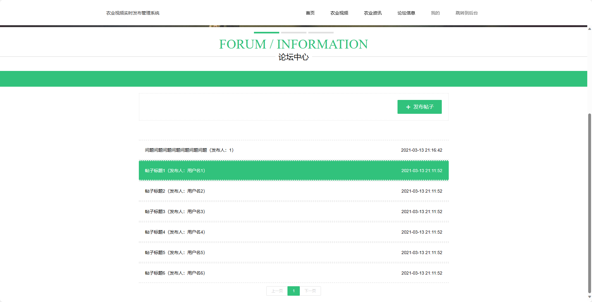
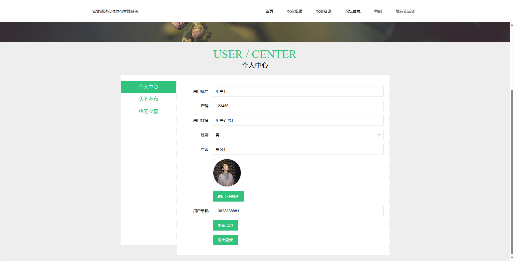
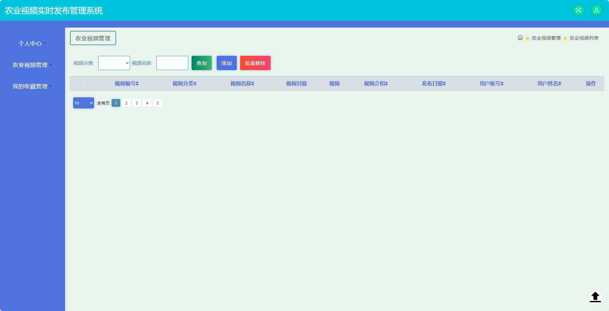

## 基于SSM的农业视频实时发布管理系统

###  获取sql数据库文件: 从戎源码网 (https://armycodes.com/) QQ: 386869957 QQ群: 377586148
###  所有系统地址: (https://github.com/YuLin-Coder/AllProjectCatalog) 
###  所有项目以及源代码本人均调试运行无问题 可支持远程安装部署调试、定制修改、代码讲解

## 项目介绍
基于SSM的农业视频实时发布管理系统，系统包含两种角色：管理员、用户,系统分为前台和后台两大模块，主要功能如下。

前台-【用户】：
1. 首页：展示网站的基本信息和推荐农业视频、农业资讯以及论坛信息，提供快捷入口和搜索功能，方便用户浏览和查找感兴趣的内容。
2. 农业视频：用户可以观看上传的农业视频，包括种植技术、养殖经验、农产品加工等内容，还可以查看视频的详细介绍和用户评论。
3. 农业资讯：用户可以浏览最新的农业资讯，包括农业政策、市场动态、科技创新等内容，方便用户了解最新的农业信息。
4. 论坛信息：用户可以参与农业相关的讨论，发布问题、分享经验、回答疑问等，与其他用户交流和互动。
5. 我的：用户可以登录或注册账号，查看个人信息和收藏记录，还可以进行发布视频、收藏、评论等操作，方便用户管理个人信息和互动记录。

后台-【管理员】：
1. 个人中心：管理员可以查看和管理个人信息，包括用户名、手机号码、员工编号等，还可以修改密码和联系方式。
2. 用户管理：管理员可以管理用户信息，包括查看用户列表、编辑用户信息、冻结用户账号等，还可以查看用户的发布视频、收藏记录和评论。
3. 视频分类管理：管理员可以管理视频分类，包括添加、编辑和删除分类，设置分类的名称和排序，还可以查看分类下的视频和统计数据。
4. 农业视频管理：管理员可以管理农业视频，包括添加、编辑和删除视频，设置视频的标题、描述、封面图等，还可以审核上传的视频和管理视频的播放量。
5. 农业资讯管理：管理员可以管理农业资讯，包括添加、编辑和删除资讯，设置资讯的标题、发布时间、作者等，还可以管理资讯的浏览量和评论。
6. 资讯类型管理：管理员可以管理资讯类型，包括添加、编辑和删除类型，设置类型的名称和排序，还可以查看类型下的资讯和统计数据。
7. 论坛信息：管理员可以管理论坛信息，包括查看帖子列表、编辑帖子内容、删除帖子等，还可以管理论坛的用户评论和统计数据。
8. 系统管理：管理员可以管理系统的基本设置，包括设置网站的名称、LOGO、SEO优化等，还可以配置网站的基本信息和权限控制。

## 项目技术
- 编程语言：Java
- 数据库：MySQL
- 前端技术：JSP、HTML、Jquery、Bootstrap
- 后端技术：Spring、SpringMVC、MyBatis

## 运行环境
- JDK版本：JDK1.8及以上
- 开发工具：IDEA、Ecplise、Myecplise都可以
- 数据库: MySQL5.7及以上

## 运行截图

